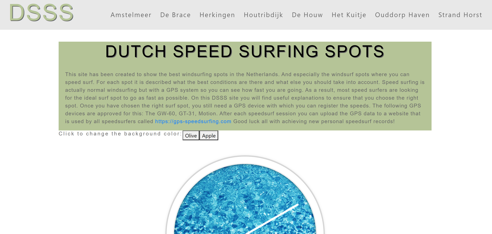

# Dutch Speed Surfing Spots

## Demo
[Live website](https://remcokes.github.io/DSSS/)

### Strategy
This site has been created to show the best windsurfing spots in the Netherlands. And especially the windsurf spots where you can speed surf. For each spot it is described what the best conditions are there and what else you should take into account. Speed surfing is actually normal windsurfing but with a GPS system so you can see how fast you are going. As a result, most speed surfers are looking for the ideal surf spot to go as fast as possible. On this DSSS site you will find useful explanations to ensure that you choose the right spot.

### User Stories

<strong>User Story 1:</strong> People who search for a speedsurfing spot in the Netherlands   
<strong>User Story 2:</strong> Speedsurfer who need help finding the right surf spot   
<strong>User Story 3:</strong> Some advanced speedsurfer who search a speedsurfing spot nearby   
<strong>User Story 4:</strong> Some speedsurfer who want to learn what the best conditions are on the speedsurfing spot that the site describe   
<strong>User Story 5:</strong> A surfer who wants to start speed surfing   

### Scope 
General information, windsurf locations, clock, Google map, social media links.
And for the Javascript order:
- a clock with a external Javascript /DSSS/assets/script/js/script_clock.js
- a map with a external Javascript /DSSS/assets/script/js/map_clock.js
- a mouse-over Javascript for the "DUTCH SPEED SURFING SPOTS" intro-title located in the index.html
- a color-theme Javascript for the intro-container. The Javascript is located in the index.html

### Structure
<ul>
    <li><strong>Header</strong>  
        With the title and a menu for all the locations
    <li><strong>Intro block</strong> 
        Information about the site and a intro-title with a mouse-over JavaScript.  
        The whole title block has a color-theme with two colors: "Olive" and "Apple".
    <li><strong>Clock</strong> 
        A clock for the time. This is part of the Milestone 2 project. 
        The assignment is to process Javascript in the website. 
        I also think it's a cool addition to the site.
    <li><strong>A Google Map</strong> 
        All 8 speedsurf locations are indicated on the Google Map. 
        If you click on the location you will also see the name of the surf spot. 
        The purpose of this map is to show the surf spot location.
    <li><strong>Locations</strong> 
        Eight descriptions of each surf spot with a photo.  
        A detailed description for each location.
     <li><strong>Footer</strong> 
        In the footer the social media links will be found, which are external links.
</ul>

### Skeleton
__Header:__  
Fixed header  

__Location_Menu:__  
On large devices: you see all the locations horizontal in the nav-bar.  
On medium and small devices: all locations are in the hamburger menu which pops down when clicked.  

__Clock:__  
A real time working clock in JavaScript.  

__Map:__  
A Google Map with eight of my favorite speed surf spots.  

__Locations:__  
On large devices: you see all the locations with a photo on the right.  
On medium and small devices: all locations are below each other and the photos in between.   

__Footer:__  
All the social media icons.

### Surface
All text with font family: arial, Helvetica, sans-serif  
All text with font color: dark grey / #666666  

__Header__ 
Background color = light gray #E8E8E8  
Website title with font color: light green / rgb(214,230,214) and text-shadow dark grey / #666666  
On large devices all the locations horizontal.  
On medium and small devices a hamburger menu icon shows. When clicked all the locations are shown vertical.  

__Intro__ 
Intro-title with font color: black with text-shadow dark grey / #666666. When mouse-over font color: white with text-shadow dark grey / #666666  
Color theme background-color olive (on start) or apple. Olive = rgb(181,196,151), apple = rgb(40,189,60). You can switch between the colors through the buttons.  

__Clock__ 
Clock color: white with a light gray border  
Clock hands: white  
Background color: water image  

__Map__ 
Full width map on all sizes.  
Red marker for each location.  
When clicked on a marker you see a pop-up with the location name.  

__Locations__ 
Three repeating colors for the text blocks: dark green / rgb(181,196,151), light gray / #E8E8E8, light green / rgb(214,230,214).  
Each location has a marker in front of the location name. The marker matches with the marker on the Google Map.  
Every location in the nav-bar is linked to the right location on the website. 
When the location in the nav-bar is clicked, you will go to the right location on the website. This is an internal location link. 

__Footer__ 
Background color: dark green / rgb(181,196,151)  
Social media icons color: #777777   
Icons are horizontal on all sizes.  
Icons are linked to the right external website. They open in a new browser. 

### Mockups
The following wireframes were created using Balsamiq to design the website layout options:  
[Small devices](assets/mockups/DSSS_Small.pdf) 
[Medium devices](assets/mockups/DSSS_Medium) 
[Large devices](assets/mockups/DSSS_Large.pdf)

## Features
The webpage consists of the following features:  
__Bootstrap Icons__ 
All grey icons are used in the footer for social media. 
In the fixed header is a _hamburger_ icon only on small and medium devices.
  
__Google Maps__ 
All locations are in one Google Map, with one API key.  
The corresponding JavaScript file is called map.js.  
Each locations has it's own pop-up with the location name.
  
__Clock__ 
JavaScript Clock.  
The corresponding JavaScript file is called clock.js. 
  
__Intro title__ 
Mouse over element with internal JavaScript. 
  
__Intro color theme__ 
Switch background color through the buttons. Has internal JavaScript. 
  
__CSS @media__ 
Everything will be good visable on all devices.

## Technologies

### Languages
[HTML5](https://en.wikipedia.org/wiki/HTML5) for the structure of the website  
[CSS](https://en.wikipedia.org/wiki/Cascading_Style_Sheets) for the styling  
[JavaScript](https://en.wikipedia.org/wiki/JavaScript) for the Google Map, the clock, the intro title mouse over element and the intro color theme.

### Frameworks / Tools / Libraries
[Balsamiq](https://balsamiq.com.) for the mockups  
[Bootstrap](https://getbootstrap.com/) for the collapsible navbar and the social media icons  
[Gitpod](https://www.gitpod.io/) was the IDE used to write the code for this website  
[GitHub](https://github.com/) for version control

### Testing
[HTML Validator](https://validator.w3.org/) for testing the HTML code  
[CSS Validator](https://jigsaw.w3.org/css-validator/) for testing the CSS code  
Google Chrome Developer Tools for testing different device sizes  
[Responsinator](https://www.responsinator.com/) for testing different device sizes 

## Testing

__Responsiveness__ 
Every page was tested for responsiveness on small, medium and large devices. 
Through the _Google Chrome Developer Tools_ I tested the following types: 
<ul>
  <li>iPhone 5/SE (portrait: 320x568 & landscape: 568x320)
  <li>Galaxy S5/Moto G4 (portrait: 360x640 & landscape: 640x360)
  <li>iPhone 6/7/8 (portrait: 375x667 & landscape: 667x375)
  <li>iPhone X (portrait: 375x812 & landscape: 812x375)
  <li>Pixel 2 (portrait: 411x731 & landscape: 731x411)
  <li>Pixel 2 XL (portrait: 411x823 & landscape: 823x411)
  <li>iPhone 6/7/8 Plus (portrait: 414x736 & landscape: 736x414)
  <li>iPad (portrait: 768x1024 & landscape: 1024x768)
  <li>iPad Pro (portrait: 1024x1366 & landscape: 1366x1024)
  <li>Surface Duo (portrait: 450x500 & landscape 600x450)
  <li>Galaxy Fold (portrait: 280x653 & landscape 653x280)
</ul>

__Header__ 
The header is fixed and responsive to small, medium and large devices.
  
__Navigation menu__ 
The links in the navigation menu are linked to the right internal webpage.
  
__Footer__ 
Social media icons, which are external links.

## Testing results
HTML validator tested on the following file: index.html. No errors found.  
CSS validator tested on the following file: style.css. No errors found.  

## Deployment
I started working on this project in Repl.it because this my hours in GitPod are limited. 

This website contains the following map:
<ul>
  <li>assets
</ul>
Inside the <strong>assets</strong> map I created five new maps:
<ul>
  <li>css
  <li>images
  <li>js
  <li>mockups
  <li>screenshots
</ul>
Inside the <strong>css</strong> map is the css style sheet called <strong>style.css</strong>. 
Inside the <strong>images</strong> map are all the images used on the website. 
Inside the <strong>js</strong> map are the two JavaScript sheets with the Google Maps information and the clock information. 
Inside the <strong>mockups</strong> map are the three mockups for small, medium and large devices. 
Inside the <strong>screenshots</strong> map is a screenshot of the website used in the README.md. 
Ending with the README.md

### Deployment left to be implemented
After this page is checked by the examinators, I will make the index.html private in GitHub for the protection of my API key.

### New Repository in GitHub
First you need an account on [GitHub](https://github.com) which you can download from [here](https://desktop.github.com). 
<ol>
  <li>Click <strong>Create a New Repository</strong>.
  <li>At <strong>Repository template</strong> you can select a template, if you have one.
  <li>At <strong>Repository name</strong> you can choose the name for you new repository.
  <li>At <strong>Description (optional)</strong> you give you repository a decription.
  <li>Next you can choose if you want a <strong>Public</strong> or a <strong>Private</strong> repository.
  <li><strong>Initialize this repository with a README</strong> you click this checkbox if you like to create a README file.
  <li>Click the green button with <strong>Create repository</strong>.
</ol>

### Creating a branch
To create a branch link you have to go to your repository in GitHub and follow the following steps:
<ol>
  <li>Click on <strong>settings</strong>.
  <li>Scroll down to <strong>GitHub Pages</strong>.
  <li>At <strong>Source</strong> the button stands on <strong>None</strong>, click it and select <strong>master branch</strong>.
  <li>Your site is ready to be published at (your branch name).
</ol>

### Push from GitPod to GitHub
When you make some changes in GitPod you can push them to GitHub.
<ol>
  <li>In GitPod click on <strong>Source Control: Git</strong>.
  <li>In the textfield you can give your changes a message name.
  <li>Underneath the line <strong>CHANGES</strong>, you see all the changes that have been made. Press the <strong>+</strong> button behind the page name which you want to be pushed. You can also press the <strong>+</strong> button next to the line <strong>CHANGES</strong>, to push all the made changes.
  <li>Klink the <strong>Commit</strong>.
  <li>On the right, press the GitPod logo with the name <strong>Pull Request</strong>.
  <li>A yellow field appears. Click the blue button with <strong>Push</strong>.
</ol>
    
### Create your own Google API key
To start you need to have a Google Account and start at the [Google Cloud Platform Console](https://cloud.google.com/console/google/maps-apis/overview).
<ol>
  <li>On the top of the Google Cloud Platform Console, next to the text <strong>Google Cloud Platform</strong> you see a drop project drop down menu.
  <li>When you click it, you will get a pop up with all your projects, if you have any.
  <li>Click on <strong>New Project</strong>.
  <li>Fill in your <strong>Project Name</strong> and click <strong>Create</strong>.
  <li>Go to your new project and click on <strong>Credentials</strong>.
  <li>Go to <strong>Credentials in APIs & Services</strong>.
  <li>Click on <strong>Create Credentials</strong> and <strong>API Key</strong>.
  <li>Copy your API Key code and paste into your website.
</ol>

## Credits

### Content
The full content is made up and written by me.

### Media
The photos used in this website were obtained from [Pixabay](https://pixabay.com/).

### Acknowledgements
Everything I learned from the [Code Institute](https://codeinstitute.net/) Fullstack Web Development course. 
I used [W3Schools](https://www.w3schools.com/) for extra general coding knowledge. 
I used the [Google Maps](https://developers.google.com/maps/documentation/javascript/get-api-key) site to create a API key and for general information. 
I used [Bootstrap](https://getbootstrap.com/) for info and offcourse to use the icons, buttons and navbar. 
